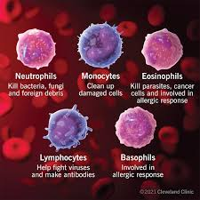

# Blood Cell Classification Web Application


This repository contains an end-to-end deep learning web application that classifies blood cell images as either Eosinophil, Lymphocyte, Monocyte, or Neutrophil. The application is built with Python and Flask, using a pre-trained VGG16 model fine-tuned on a dataset of blood cell images. It is designed for easy deployment on AWS infrastructure with continuous integration and deployment (CI/CD) using GitHub Actions.

---

## Table of Contents
- [Project Overview](#project-overview)
- [Dataset](#dataset)
- [Features](#features)
- [Technologies Used](#technologies-used)
- [Pipeline Stages](#pipeline-stages)
- [Directory Structure](#directory-structure)
- [Setup and Installation](#setup-and-installation)

- [ASW Deployment](#deployment)
- [Usage](#usage)
- [Development Setup](#development-setup)
- [Future Work](#future-work)

---

## Overview

Diagnosing blood-related diseases often requires identifying and analyzing patient blood samples. Automated techniques for detecting and classifying blood cell subtypes play a crucial role in advancing medical diagnostics. This project aims to classify blood cell images to support medical diagnosis. The web application allows users to upload an image of a blood cell, which is then classified as one of four types:
- Eosinophil
- Lymphocyte
- Monocyte
- Neutrophil

This application classifies blood cell images using a Convolutional Neural Network (CNN) model fine-tuned from the VGG16 model pre-trained on the ImageNet dataset. The model was modified to include a flatten layer and a softmax dense layer with 4 output units for multi-class classification. Blood cell images are served to the model through a web app built with Flask, and the application is fully containerized using Docker and hosted on an AWS EC2 instance.

## Dataset

The dataset used for training and evaluating the model was sourced from [Kaggle](https://www.kaggle.com/datasets/paultimothymooney/blood-cells/data). This dataset contains augmented images of blood cells (JPEG) for each of 4 different cell types grouped into 4 different folders (according to cell type). The compressed dataset was stored in AWS S3 and downloaded from there for model training and evaluation. 

## Features

- **Transfer Learning**: Leveraging VGG16 pretrained on ImageNet for efficient classification.
- **Automated Pipeline**: Data ingestion, model training, and evaluation managed with DVC.
- **Web Application**: Flask-based interface for uploading and classifying blood cell images.
- **CI/CD Deployment**: Docker, GitHub Actions, and AWS integration for continuous deployment.
- **AWS Hosted**: Application hosted on an EC2 instance with Docker image pulled from ECR.

## Technologies Used

- **Python**: Data processing, modeling, and backend application.
- **TensorFlow / Keras**: CNN model architecture, transfer learning, and training.
- **Flask**: Web application framework for serving the model.
- **DVC**: Pipeline management for reproducible machine learning.
- **Docker**: Containerization for consistent deployment across environments.
- **GitHub Actions**: CI/CD pipeline for automatic deployment on AWS.
- **AWS (ECR, EC2, IAM)**: Cloud infrastructure for hosting and managing the application.

## Pipeline Stages

The project follows a well-defined pipeline using **DVC** to organize data and model pipelines. Pipeline stages include:
1. **Data Ingestion**: Downloads the dataset from S3 to a local storage.
2. **Base Model Development**: Defines the base CNN model architecture (VGG16 with transfer learning).
3. **Model Training**: Trains the modified VGG16 model with the blood cell images.
4. **Model Evaluation**: Evaluates the model on the validation set to assess accuracy.

## Directory Structure

```
.
├── .github/                  # Flask application code
│   └── workflows/
│       └── main.py
├── artifacts/
│   ├── data_ingestion/
│   ├── prepare_base_model/
│   ├── prepare_callbacks/
│   └── training/
├── static/           # Static files (CSS, JS)
│   ├── templates/        # HTML templates
│   └── app.py            # Main Flask application
├── model/                # Model training and evaluation code
├── data/                 # Data ingestion and processing scripts
├── Dockerfile            # Docker configuration file
├── requirements.txt      # Python dependencies
├── dvc.yaml              # DVC pipeline stages
└── README.md             # Project documentation
```

## Deployment

### Infrastructure

The application is hosted on AWS infrastructure, with the following setup:
1. **IAM User**: Configured with specific EC2 and ECR access policies.
2. **ECR Repository**: Stores the Docker image of the application.
3. **EC2 Instance**: Serves as the self-hosted runner for the GitHub Actions CI/CD pipeline and runs the application in a Docker container.

### CI/CD Workflow

The **GitHub Actions** workflow automates the CI/CD process as follows:
1. **Build Docker Image**: Creates a Docker image of the source code.
2. **Push Image to ECR**: Uploads the Docker image to AWS ECR.
3. **Launch EC2 Instance**: If not already running, launches an EC2 instance.
4. **Deploy to EC2**: Pulls the image from ECR to the EC2 instance and runs the application container.

**GitHub Secrets** are used to securely store AWS credentials, and changes pushed to the main branch automatically trigger the deployment pipeline.

## Usage

1. **Upload Image**: Access the web application hosted on the EC2 instance and upload an image of a blood cell.
2. **View Prediction**: The application will classify the cell as an eosinophil, lymphocyte, monocyte, or neutrophil and display the result.

## Development Setup

To set up the project for development or testing, follow these steps:

### Prerequisites
- **Docker**: Ensure Docker is installed on your local machine.
- **AWS CLI**: Set up AWS CLI with access credentials for EC2 and ECR.
- **Python**: Install Python 3.8 or later with dependencies listed in `requirements.txt`.

### Steps
1. **Clone Repository**:
   ```bash
   git clone https://github.com/username/repo-name.git
   cd repo-name

